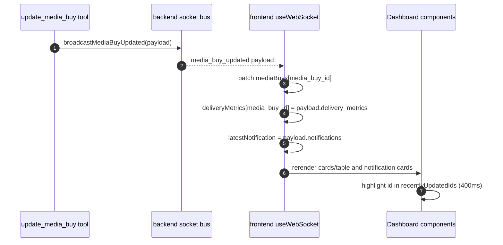

# Realtime Architecture and Socket Events

This document defines the implemented realtime behavior for campaign state and dashboard updates.

## 1) Socket.io Topology

- Backend Socket.io server is initialized in `src/backend/src/websocket/socket.ts` from the same HTTP server used by Express.
- Frontend client hook is `src/frontend/src/hooks/useWebSocket.ts`.
- On each socket connection, server emits `initial_state` to bootstrap the UI.

## 2) Server Event Contracts

### `initial_state` (server → client)

Sent automatically on connect and on `request_state`:

```json
{
  "products": [],
  "media_buys": [],
  "delivery_metrics": {},
  "aggregations": {},
  "performance_feedback_log": []
}
```

Matches the backend shape from `getFullState()` in `src/backend/src/data/loader.ts`.

### `media_buy_updated` (server → client)

```ts
{
  media_buy_id: string,
  media_buy: MediaBuy,
  delivery_metrics: DeliveryMetrics | null,
  changes_applied: ChangeApplied[],
  timestamp: string, // ISO
  notifications?: NotificationResult
}
```

Where `ChangeApplied` contains:
- `operation` (`remove_geo`, `add_geo`, `adjust_bid`, `set_daily_cap`, `shift_budget`, `set_status`)
- `details`
- optional `previous_value`, `new_value`

This event is emitted after successful `update_media_buy`.

### `media_buy_created` (server → client)

```ts
{
  media_buy_id: string,
  media_buy: MediaBuy,
  delivery_metrics: DeliveryMetrics,
  estimated_impressions: number,
  timestamp: string
}
```

Emitted after successful `create_media_buy`.

### `feedback_submitted` (server → client)

```ts
{
  feedback_id: string,
  media_buy_id: string,
  feedback_type: "conversion_data" | "lead_quality" | "brand_lift",
  impact: string,
  timestamp: string
}
```

Emitted after `provide_performance_feedback`.

## 3) Client→Server Event

### `request_state` (client → server)

- Emitted by frontend hook helper when refresh is required.
- Causes server to emit `initial_state` back to the requesting client.

## 4) Frontend State Mapping (`useWebSocket.ts`)

The hook maintains:

- `mediaBuys: MediaBuy[]`
- `deliveryMetrics: Record<string, DeliveryMetrics>`
- `isConnected: boolean`
- `lastUpdated: Date | null`
- `recentlyUpdatedIds: Set<string>` (for temporary highlight animation)
- `latestNotification: CampaignUpdateNotification | null`
- `activeCampaignId: string | null`

Event handling behavior:

- `initial_state`
  - sets `mediaBuys` and `deliveryMetrics`, resets `lastUpdated`
- `media_buy_updated`
  - replaces matching `mediaBuys` entry
  - updates metrics map
  - if notifications present, builds notification object and sets `activeCampaignId`
  - marks campaign as recently updated for UI flash
- `media_buy_created`
  - appends to `mediaBuys`, inserts metrics
  - marks as recently updated
- `feedback_submitted`
  - updates timestamp and marks campaign as recently updated

`markAsUpdated` removes highlight after 400ms.

## 5) Realtime Data Flow (End-to-End)



## 6) Integration with Chat Notifications

- In chat flow, `MainContainer.tsx` reads:
  - `latestNotification` from `useWebSocket`
  - opens campaign panel automatically
  - shows Slack confirmation/email draft cards inline in chat under the conversation
- If a user sends a new message, UI continues to handle streaming independently while state stream may update simultaneously.

## 7) Failure Modes

- If websocket cannot connect:
  - `isConnected = false`
  - dashboard still renders using existing state and reconnection attempts are enabled client-side
- If events arrive before full state:
  - client updates known entries; unknown IDs still get inserted for created events
- If an event payload is malformed, handler may throw depending on runtime types; current implementation expects server-shaped payloads.

## 8) Suggested Hardening Checklist (Non-Blocking)

- Add runtime schema validation on websocket payloads before applying state.
- Add versioning or sequence IDs in events for stale-event suppression.
- Add dedupe in update event stream (same campaign update arriving rapidly from retries).
- Add explicit server-side room scoping if multi-tenant isolation is later required.

