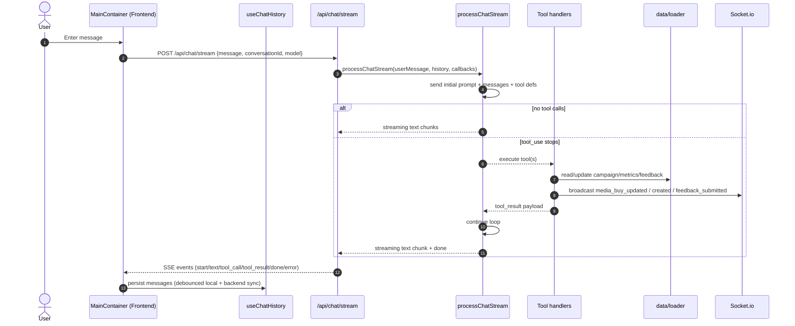

# ADCP Sales Agent Demo — System Overview (Implemented Architecture)

This document describes the implemented architecture and data flow for the project in this repo (`adcp-demo`).

## 1) Runtime Architecture

The project has two runtime services:

- `src/frontend` (Next.js 14 App Router) for the chat UI and dashboard UI
- `src/backend` (Express + Socket.io + Anthropic SDK) for chat orchestration, tool execution, and campaign state

At a high level, user input flows from the frontend into the backend chat API, which forwards the message to Claude with AdCP tool definitions. Tool calls mutate in-memory domain state, which is broadcast over WebSocket to any connected dashboards.

## 2) Main Components

### Backend

- **`src/backend/src/index.ts`**
  - Boots Express + HTTP server + Socket.io
  - Loads demo data on startup
  - Registers routes (`/api/tools`, `/api/chat`, `/api/notifications`, `/health`)
- **`src/backend/src/routes/chat.ts`**
  - `POST /api/chat` non-streaming
  - `POST /api/chat/stream` SSE streaming
  - conversation persistence endpoints (list, save, fetch, delete)
- **`src/backend/src/claude/client.ts`**
  - Maintains Claude tool definitions
  - Executes tool loops (`processChat`, `processChatStream`)
  - Streams text chunks and tool events to the chat endpoint
- **`src/backend/src/routes/tools.ts`**
  - Generic tools proxy (`/api/tools/:toolName`)
- **`src/backend/src/tools/*`**
  - Domain tool implementations (`get_products`, `create_media_buy`, `update_media_buy`, etc.)
- **`src/backend/src/data/loader.ts`**
  - Loads and serves in-memory domain data from `data/adcp_demo_complete_data.json`
  - Provides getter/setter helpers for products/media buys/metrics/feedback
- **`src/backend/src/data/conversationStore.ts`**
  - Disk persistence for chat conversations in `data/conversations/*.json`
- **`src/backend/src/services/*`**
  - `notificationService.ts`: Slack + email orchestration after update
  - `slackService.ts`: Slack payload + webhook sender
  - `emailService.ts`: draft generation + send (Resend API or simulated)
- **`src/backend/src/websocket/socket.ts`**
  - Socket.io events and broadcasters (`media_buy_updated`, `media_buy_created`, `feedback_submitted`)

### Frontend

- **`src/frontend/src/components/chat/MainContainer.tsx`**
  - Orchestrates chat lifecycle and streaming response rendering
  - Integrates artifact detection and campaign side panel behavior
- **`src/frontend/src/hooks/useChatHistory.ts`**
  - Local conversation history in `localStorage`
  - Backend conversation sync endpoints integration
- **`src/frontend/src/hooks/useWebSocket.ts`**
  - Connects Socket.io client
  - Maintains live campaign state (`mediaBuys`, `deliveryMetrics`, `latestNotification`)
- **`src/frontend/src/utils/artifactDetection.ts`**
  - Detects when tool results should render table/report side artifacts
- **`src/frontend/src/components/dashboard/*`**
  - Dashboard shell and views backed by live websocket state

## 3) Startup Sequence

1. Backend `loadData()` loads JSON payload into in-memory dataset.
2. Conversation directory is initialized and files are loaded into memory.
3. Express middlewares/routes are mounted.
4. Socket.io attaches to the same HTTP server; on new client connection backend emits `initial_state`.
5. Frontend loads:
   - `MainContainer` for chat UI
   - `useChatHistory` loads local state and merges backend conversation metadata
   - `useWebSocket` connects to Socket.io and waits for `initial_state`
6. User sends message, backend processes via Claude + tools as needed, response returns over SSE.

## 4) Data Sources and State

- **Primary campaign state**: In-memory object graph in `loader.ts`
- **Conversation metadata/messages**:
  - Frontend local cache: browser `localStorage` key `adcp_chat_history`
  - Backend file persistence: `data/conversations/<conversationId>.json`
- **Live sync**: Backend websocket pushes campaign deltas while mutating tools.

## 5) End-to-End Chat Flow

## 6) Campaign Mutation and Notification Flow

- `create_media_buy`:
  - Adds media buy + initial metrics in loader state
  - Broadcasts `media_buy_created` event
- `update_media_buy`:
  - Resolves campaign ID/brand alias
  - Applies update operations on in-memory state
  - Persists campaign + metrics
  - Sends Slack + generated email draft (if configured)
  - Broadcasts `media_buy_updated` including change list and notification status
- `provide_performance_feedback`:
  - Adds feedback entry to `performance_feedback_log`
  - Broadcasts `feedback_submitted`

## 7) Observability of State in UI

- **Chat tab**
  - Streaming assistant text appears in real-time
  - Tool calls can trigger an artifact panel
  - Latest update notification cards are shown from websocket notifications
- **Dashboard tab**
  - Receives initial full state on connect
  - Updates rows/cards as events arrive
  - Highlights recently updated campaign cards for 400ms

## 8) Environment and Runtime Contracts

- Required for full AI behavior: `ANTHROPIC_API_KEY` (backend `.env`)
- Optional notifications:
  - `SLACK_WEBHOOK_URL`
  - `RESEND_API_KEY`
- Ports: frontend dev server `5000`, backend server `3001`

## 9) Known Non-Production Aspects

- Campaign/media-buy state is in-memory; restart resets to JSON seed data.
- Files under `data/conversations` persist conversation history.
- Notification email draft storage is in-memory during runtime.

