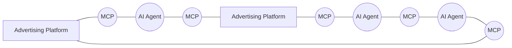
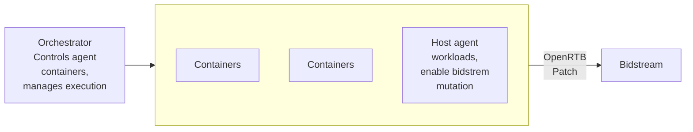
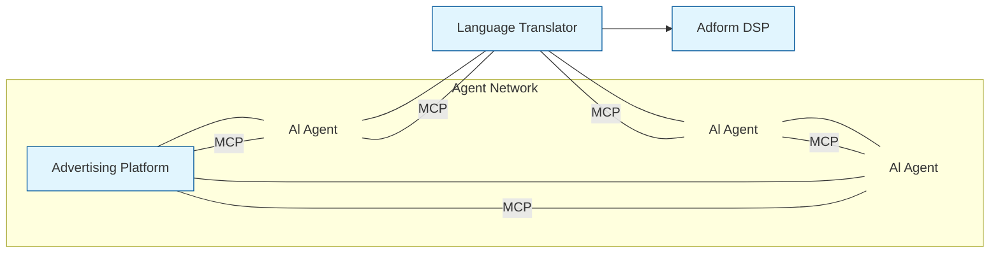
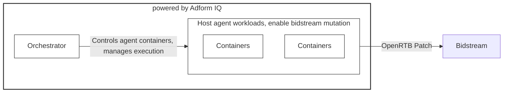

# AI in Advertising: AdCP vs ARTF Extended Pre-Read
## Comparing advanced AI solutions transforming advertising strategies

1
adform

# Introduction and Context

adform

# Industry Shift to AI-Native Advertising

## AI-Driven Advertising Evolution
Advertising is shifting from human rules to autonomous AI agents for improved efficiency and personalization.

* **Ad Context Protocol (AdCP)**
  AdCP enables seamless agent-to-agent communication across advertising workflows from planning to measurement.

* **Agentic RTB Framework (ARTF)**
  ARTF introduces containerized agents in real-time bidding to securely modify bid streams and improve transparency.
  More restricted scope.

## Strategic Implications
Understanding and adopting these protocols is essential for competitiveness in the AI-native advertising era.

adform

# Core Concepts

adform

# Agent-to-Agent Communication vs Agent Containers

## Scope and Focus Differences
AdCP spans the full advertising lifecycle promoting interoperability, while ARTF focuses on auction-time decisioning with strict platform control.

### Agent-to-Agent Communication (AdCP)
AdCP enables direct communication between AI agents across platforms, standardizing tasks like audience discovery and campaign optimization using MCP.

### Agent Containers in RTB (ARTF)
ARTF embeds containerized agents in real-time bidding infrastructure for low latency tasks like bid adjustments and fraud detection.

5
adform

# Core Technologies: MCP vs OpenRTB Patch + gRPC

* MCP focuses on flexibility and interoperability;
* OpenRTB Patch and gRPC emphasize speed, security, and control in auctions.

### Model Context Protocol (MCP)
MCP uses JSON-RPC for structured, context-rich AI agent communication, supporting discovery and negotiation across platforms.

### OpenRTB Patch Technology
OpenRTB Patch enables atomic, intent-driven mutations in bid requests allowing secure and efficient auction orchestration.

### gRPC High-Performance Calls
gRPC delivers sub-millisecond remote procedure calls for container orchestration ensuring low-latency communication in RTB systems.

Sample Footer Text
1/28/2026
6
adform

# Architectures and Workflows

adform

# Architecture Overview

Both architectures aim for modularity and scalability, focusing on interoperability for AdCP and secure execution for ARTF.

## AdCP Architecture

AdCP uses distributed AI agents connected by MCP interfaces for cross-platform collaboration without custom integrations.

### Agent-to-Agent Communication

## ARTF Architecture

ARTF embeds containerized agents within SSP or DSP, interacting with orchestrators using gRPC and OpenRTB Patch.

8
adform

# Workflow Visualization

**AdCP Agent Discovery and Negotiation**
Advertiser agents identify publisher agents and negotiate campaign terms using MCP for activation.

**Continuous Execution and Optimization**
Agents exchange performance signals in real time to optimize campaigns dynamically.

---

**ARTF Auction and Mutation Handling**
Orchestrator invokes container to process bids, propose atomic mutations, ensuring auditability and low latency.

9
adform

<table>
  <thead>
    <tr>
        <th>Pros</th>
        <th>Cons</th>
    </tr>
  </thead>
  <tbody>
    <tr>
        <td>* **AdCP Interoperability and Innovation** AdCP enables broad interoperability and AI-native workflows, fostering innovation with an open governance model.</td>
        <td>* **AdCP Adoption Challenges** AdCP adoption is nascent and depends on widespread industry participation for success, driven by few private companies.</td>
    </tr>
    <tr>
        <td>* **ARTF Security and Modularity** ARTF offers strong security, privacy controls, and modular container-based orchestration ideal for RTB optimizations.</td>
        <td>* **ARTF Scope and Complexity** ARTF focuses on RTB with operational complexity in container management as a limitation.</td>
    </tr>
  </tbody>
</table>

Sample Footer Text
1/28/2026
10
adform

# What does it mean for Adform?

adform

Strategic Implications for Adform

# AdCP Adoption

### ◎ Cross-Platform Interoperability
Supporting AdCP allows Adform to act as an open endpoint, enabling seamless agentic workflows across platforms, while keeping control of the infrastructure. Probably the easiest path, requiring a 'translator' to adapt our API decisioning system to the MCP 'language'

## Agent-to-Agent Communication

12
adform

# Strategic Implications for Adform

## ARTF Adoption

### ◎ Enhanced In-Auction Decisioning
Implementing ARTF with container orchestration and OpenRTB Patch improves secure, real-time auction optimizations.
More complex as affects directly our bidding algos. Could be part of Adform IQ.

#### powered by Adform IQ

13
adform